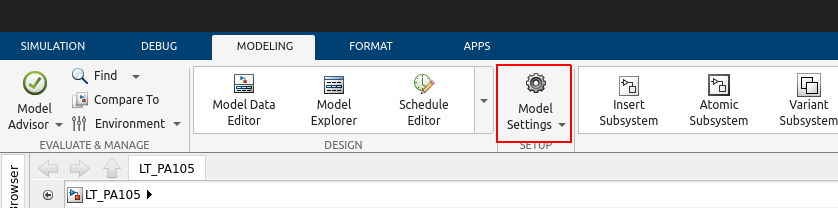
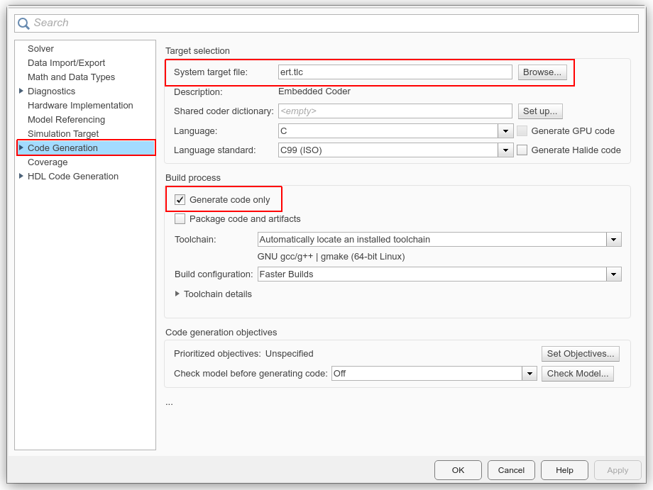
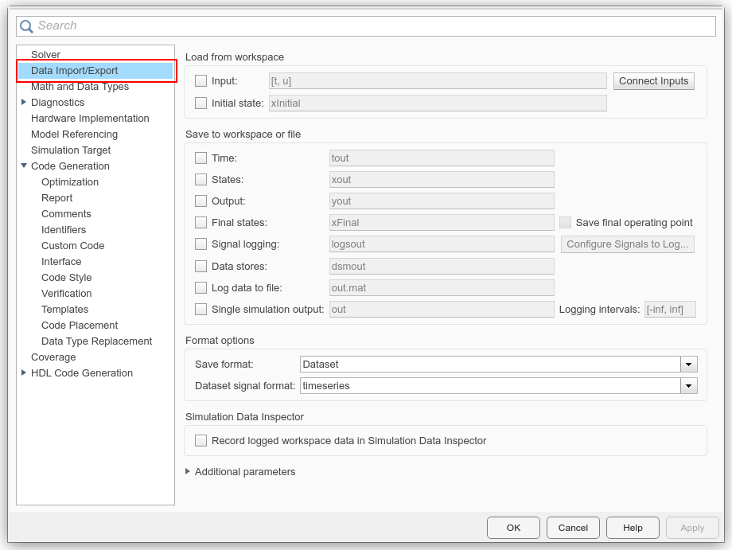

# MATLAB Instrumentation Toolkit

This repo contains tools for MATLAB/SimuLink Instrumentation and CodeGen.

### Embedded Real-Time CodeGen Config
1. Open Model Settings
<p align="center">
  
</p>

2. In Code Generation
    - Set System Target File to `ert.tlc`
    - Check Generate Code Only
<p align="center">
  
</p>

3. In Data Import/Export
    - Uncheck all the Boxes
<p align="center">
  
</p>

### Build a Subsystem
1. Right Click Subsystem
2. From C/C++ Code Submenu
3. Choose Build this Subsystem

### Build Process Output
- Generated Folder Name: `model_name_ert_rtw`
- Main Entry Point: `ert_main.c`
```c
void rt_OneStep(void) {
    static boolean_T OverrunFlag = false;
    if (OverrunFlag) {
        rtmSetErrorStatus(Level_Controller_M, "Overrun");
        return;
    }
    OverrunFlag = true;

    /* Step the model */
    Level_Controller_step();

    OverrunFlag = false;
}

int_T main(int_T argc, const char* argv[]) {
    /* Unused arguments */
    (void)(argc);
    (void)(argv);

    /* Initialize model */
    Level_Controller_initialize();

    /* Attach rt_OneStep to a timer or interrupt service routine with
     * period 0.001 seconds (base rate of the model) here.
     * The call syntax for rt_OneStep is
     *
     *  rt_OneStep();
     */

    /* Terminate model */
    Level_Controller_terminate();
    return 0;
}
```
- Subsystem Entry Point: `model_name.c > void model_name_step(void)`

### Compile Generated C Code
1. Make Sure You Have [make](https://community.chocolatey.org/packages/make) on Your Machine
2. Navigate to Generated Folder: `model_name_ert_rtw`
3. run
```bash
$ make -f ./model_name.mk 

### Created: ../Level_Controller
### Successfully generated all binary outputs.
```
